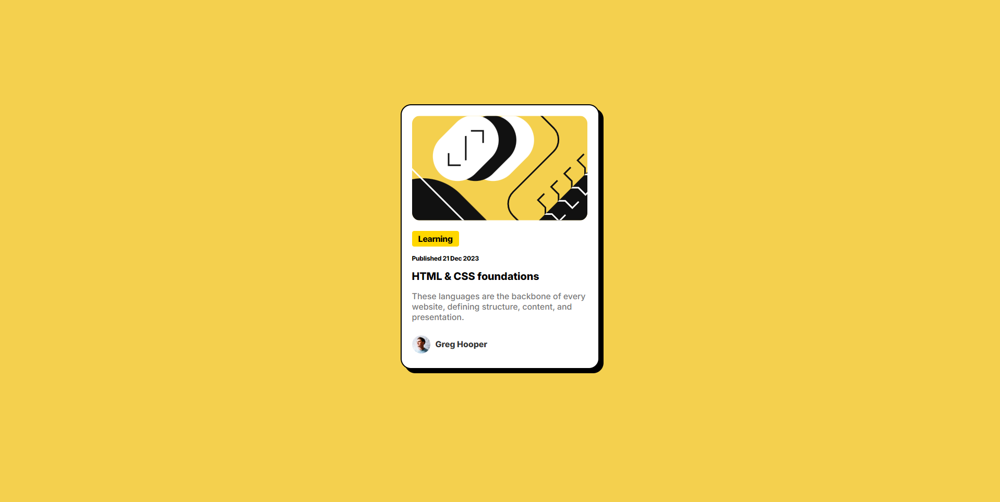

# Frontend Mentor - Blog preview card solution

This is a solution to the [Blog preview card challenge on Frontend Mentor](https://www.frontendmentor.io/challenges/blog-preview-card-ckPaj01IcS). Frontend Mentor challenges help you improve your coding skills by building realistic projects.

## Table of contents

- [Overview](#overview)
  - [The challenge](#the-challenge)
  - [Screenshot](#screenshot)
  - [Links](#links)
- [My process](#my-process)
  - [Built with](#built-with)
  - [What I learned](#what-i-learned)
  - [Continued development](#continued-development)
  - [Useful resources](#useful-resources)
- [Author](#author)
- [Acknowledgments](#acknowledgments)

**Note: Delete this note and update the table of contents based on what sections you keep.**

## Overview

I was afraid from CSS, just few days ago but then I saw a video about someone's experience. I saw a tutorial and it was great and I am still watching that tutorial. It makes me feel great because I can understand now how HTML and CSS works. It feels great. I can not tell you how good feeling this is. How ever I finished this challenge and suprisingly I done responsive design without knowing I am making responsive design. I just used the flex. After finishing the Desktop version I typed how to make responsive design without meida queries and it was saying use flex, grid etc. I knew I've used flex. Then I thought about is that posible to make a responsive without knowing its a responsive design. I was making a responsive design then I just realised I made a responsive design Without knowing thats a responsive design.

### The challenge

Users should be able to:

- See hover and focus states for all interactive elements on the page

### Screenshot

](./screenshot.jpg)

### Links

- Solution URL: [Add solution URL here](https://your-solution-url.com)
- Live Site URL: [Add live site URL here](https://your-live-site-url.com)

## My process

First I wrote all the HTML then I gave some background color to my wrapper element then all the css from in a order top to bottom.

### Built with

- Semi-semantic HTML5
- Flexbox

### What I learned

I have learned flex and grid can be used for responsive design, letter spacing, and some blue neon

```html
I am proud of all the class names I chose to my HTML elements
```

```css
body {
  font-family: "Inter", serif;
  font-optical-sizing: auto;
  font-weight: 500;
  font-style: normal;
  font-size: 16px;
  background-color: hsl(47, 88%, 63%);
}
.attribution {
  font-size: 11px;
  text-align: center;
}
.attribution a {
  color: hsl(228, 45%, 44%);
}
main {
  background-color: hsl(0, 0%, 100%);
  display: flex;
  flex-direction: column;
  padding: 20px;
  width: 337px;
  margin: 0 auto;
  margin-top: 200px;
  border-radius: 20px;
  border: 2px solid #000;
  box-shadow: 8px 8px 0px #000;
}
.lesson--img {
  border-radius: 15px;
  margin-bottom: 20px;
}
.status {
  display: inline-block;
  background-color: gold;
  width: 80px;
  height: 20px;
  padding: 5px;
  border-radius: 4px;
  text-align: center;
  margin-bottom: 15px;
  font-weight: 800;
  letter-spacing: -0.5px;
}
.publish-date {
  letter-spacing: -0.3px;
  font-size: 12px;
  margin-bottom: 15px;
  font-weight: 800;
}
.link:link,
.link:visited {
  display: inline-block;
  font-weight: 800;
  color: #000;
  text-decoration: none;
  font-size: 20px;
}
.link:hover,
.link:active {
  color: hsl(47, 88%, 63%);
  text-shadow: 0 0 5px #0ff, 0 0 10px #0ff, 0 0 20px #0ff, 0 0 40px #0ff,
    0 0 80px #0ff;
}
.description {
  color: #777;
}
.author--description {
  display: flex;
  align-items: center;
  gap: 10px;
}
.profile--photo {
  width: 35px;
  height: 35px;
}
.author {
  font-weight: 800;
  color: #333;
}
```

### Continued development

Using Flex
Using Grid
Shadowing
text-align
justify-content

### Useful resources

- [MDN Web Docs](https://developer.mozilla.org/en-US/docs/Web/CSS/letter-spacing) - I was stuck with how does letter spacing work first I tried to put some value with '0.1' but it did not work then I typed how can I use it then I saw The MDN Web Docs at the top of the page there is some value that saying use with 'minus' I said thats it I am going to code it then I coded it.
- [Figma](https://www.figma.com/) - Figma helped me to look at the example.
- [ChatGPT](https://chatgpt.com/) - I learned Flex and Grid can be responsive.

## Author

- Frontend Mentor - [@BenixCat](https://www.frontendmentor.io/profile/BenixCat)

## Acknowledgments

Thanks ChatGPT for teaching me Grid and Flex can be responsive.
